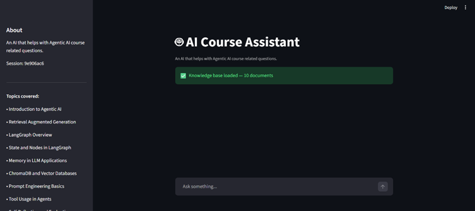

# 🤖 Agentic AI Course Assistant

An AI-powered assistant built using **RAG (Retrieval-Augmented Generation)** and **LangGraph**, designed to provide accurate, grounded, and context-aware answers for AI-related queries.



---

## 🚀 Features

- 🔍 **RAG-based Retrieval** – Retrieves relevant documents using ChromaDB to generate grounded answers  
- 🧠 **Agentic Workflow (LangGraph)** – Uses a graph-based pipeline for structured decision-making  
- 🔀 **Smart Routing** – Automatically routes queries to retrieval, tool, or skip paths  
- 🧮 **Tool Integration** – Supports mathematical computations via a calculator tool  
- 💬 **Conversation Memory** – Maintains recent chat history for context-aware responses  
- ✅ **Evaluation Metrics** – Measures answer quality using faithfulness and relevance  
- 🛡️ **Safe Handling** – Handles out-of-scope and adversarial queries by refusing or admitting uncertainty  

---

## ⚠️ User Disclaimer

A list of 10 documents related to an Agentic AI course is used to demonstrate the project. One can add any number of documents of any specific course for personal use.

---

## 🧠 How It Works

1. The user query is processed and stored in memory  
2. The router decides whether to retrieve data, use a tool, or skip  
3. Relevant documents are retrieved from ChromaDB (if needed)  
4. Tools are executed for computation-based queries  
5. The LLM generates an answer using retrieved context  
6. The response is evaluated and stored for future context  

---

## 🛠️ Tech Stack

- Python  
- LangGraph  
- ChromaDB  
- SentenceTransformers  
- Groq API (LLaMA 3)  
- Streamlit  

---

## 📂 Project Structure

- Agent.py                      # Backend Logic (Graph + Nodes)
- AI-Course-Assistant.py        # Streamlit UI
- capstone-experiments.ipynb    # A notebook used for experimenting on various features of the AI model.
- requirements.txt              # Has all the packages required to run this

---


## ⚙️ Setup & Installation

### 1. Clone the repository
```bash
git clone https://github.com/your-username/agentic-ai-assistant.git
cd agentic-ai-assistant
```

### 2. Create virtual environment
```bash
python -m venv .venv
venv\Scripts\activate 
```

### 3. Install dependencies
```bash
pip install -r requirements.txt
```

### 4. Set environment variables
```bash
GROQ_API_KEY = "YOUR API KEY FROM GROQ"
```

### 5. Run the streamlit app (after adding your own documents in DOCUMENTS list)
```bash
streamlit run AI-Course-Assistant.py
```

---

## 🧪 Evaluation

The system is evaluated using:

- Faithfulness
- Answer Relevance

---

## 🔒 Safety Handling

- Refuses unsafe or adversarial prompts
- Admits lack of knowledge for out-of-scope queries
- Avoids hallucinated responses

---

## 🚧 Future Improvements
- Improve retrieval using hybrid search and re-ranking
- Add more tools and external integrations
- Implement long-term memory
- Optimize performance and latency
- Use full RAGAS evaluation
- Handle multi-course documents

---

In order to use the Agentic AI course Assistant just go to the url:
[CLick here](https://xyz.com)
